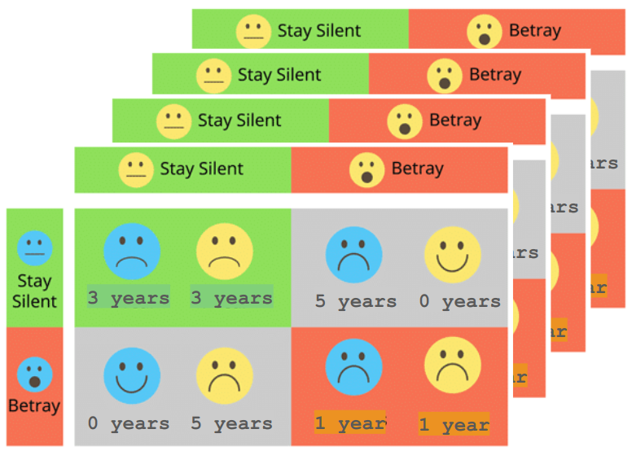

<a name="readme-top"></a>

<!-- PROJECT SHIELDS -->


<!-- PROJECT TITLE -->
# [Evolving Strategies for the Iterated Prisoner’s Dilemma](#readme-top)

<div align="center">

## 🤖⚙️ Optimization for Artificial Intelligence  
#### 📚 University of Trieste, Academic Year 2024–2025  
#### 🎓 Data Science and Artificial Intelligence Master's Program  

[](https://github.com/luispky/OptimizationForArtificialIntelligence-UniTS)

</div>

---

<details>
<summary><strong>Table of Contents</strong> (Click to expand)</summary>

- [Evolving Strategies for the Iterated Prisoner’s Dilemma](#evolving-strategies-for-the-iterated-prisoners-dilemma)
  - [🤖⚙️ Optimization for Artificial Intelligence](#️-optimization-for-artificial-intelligence)
      - [📚 University of Trieste, Academic Year 2024–2025](#-university-of-trieste-academic-year-20242025)
      - [🎓 Data Science and Artificial Intelligence Master's Program](#-data-science-and-artificial-intelligence-masters-program)
  - [Author Information](#author-information)
  - [About the Project](#about-the-project)
    - [Project Description](#project-description)
    - [Project Structure](#project-structure)
    - [Slides](#slides)
    - [Built With](#built-with)
  - [Getting Started](#getting-started)
    - [Prerequisites](#prerequisites)
      - [Conda Environment](#conda-environment)
    - [Environment Configuration](#environment-configuration)
  - [Usage](#usage)
    - [`axelrod_tournament_and_tests.py`](#axelrod_tournament_and_testspy)
      - [Supported Test Modes](#supported-test-modes)
      - [Example Usage](#example-usage)
    - [`test_evo_strategy.py`](#test_evo_strategypy)
      - [To Run the Tests](#to-run-the-tests)
    - [`ga_axelrod_tournament.py`](#ga_axelrod_tournamentpy)
      - [Command-Line Arguments](#command-line-arguments)
      - [Example Usage](#example-usage-1)
    - [`coevolutionary_axelrod_tournament.py`](#coevolutionary_axelrod_tournamentpy)
      - [Command-Line Arguments](#command-line-arguments-1)
      - [Example Usage](#example-usage-2)
  - [Acknowledgments](#acknowledgments)

</details>

---

## Author Information

| 👤 Name           | Surname         | 🎓 Student ID | 📧 UniTS Email                                 | 📧 Gmail                     |
|-------------------|-----------------|---------------|-----------------------------------------------|-----------------------------|
| Luis Fernando    | Palacios Flores | SM3800038     | luisfernando.palaciosflores@studenti.units.it | lf.palaciosf@gmail.com      |

---

## About the Project

> **ℹ️ Generative Tools Notice ℹ️**  
> Generative AI tools have assisted in this project's development. Specifically, they helped to refine code readability, clarify tool functionality, fix minor bugs, write documentation, and improve overall clarity. Nonetheless, the authors remain the primary creators of the ideas and retain full ownership of the creative process.

### Project Description

🔍 This project addresses the problem of evolving strategies for the Iterated Prisoner's Dilemma. The Iterated Prisoner's Dilemma is a game in which two players interact repeatedly, and in each round they can choose to cooperate or defect. The players receive a payoff based on their choices, and the game is played for a certain number of rounds. The goal is to maximize the total payoff over the course of the game. Here, the aim is to evolve strategies that outperform those presented in the computer tournament described in the [Effective Choice in the Prisoner’s Dilemma](https://www.jstor.org/stable/173932) paper by Robert Axelrod.

### Project Structure

📂 The project is organized into the following structure:

```plaintext
├── scripts
│   ├── axelrod_tournament_and_tests.py
│   ├── coevolutionary_axelrod_tournament.py
│   ├── ga_axelrol_tournament.py
│   └── test_evo_strategy.py
└── src
    ├── evo_strategy.py
    ├── game.py
    ├── __init__.py
    ├── strategies.py
    └── utils.py
```

- **`scripts/`**: Contains the main scripts to run the experiments.
  - **`axelrod_tournament_and_tests.py`**: Runs the Axelrod tournament and tests for the implemented Iterated Prisoner's Dilemma classes.
  - **`test_evo_strategy.py`**: Tests the evolutionary strategy using the `Match` and `Tournament` classes.
  - **`ga_axelrol_tournament.py`**: Runs the genetic algorithm for the Iterated Prisoner's Dilemma.
  - **`coevolutionary_axelrod_tournament.py`**: Runs the coevolutionary Axelrod tournament.
- **`src/`**: Contains the source code.
  - **`strategies.py`**: Implements the various strategies for the Iterated Prisoner's Dilemma.
  - **`evo_strategy.py`**: Implements the evolutionary strategy.
  - **`game.py`**: Contains the `Match`, `Tournament`, `GAIteratedPrisonersDilemma`, and `CoevolutionaryIteratedPrisonersDilemma` classes.
  - **`utils.py`**: Contains utility functions.

### Slides

📑 View the project presentation slides [here](https://docs.google.com/presentation/d/15GDoMSCmhxDJbj0pptW-3bL7dc2x_fR5Mxz1xXzAHRA/edit?usp=sharing).

### Built With

🛠️ This project leverages the following tools and libraries:

- 
- 

---

## Getting Started

Follow these steps to set up the project environment. 🚀

### Prerequisites

#### Conda Environment

🐍 Create and activate a Conda environment:

```bash
conda env create -f oai-env.yml
conda activate OAI
```

### Environment Configuration

<details>
<summary><strong>Click to expand for detailed environment setup instructions 🤓</strong></summary>

To ensure that all scripts run correctly, make sure your environment is set up properly:

1. **PYTHONPATH**:  
   Set the `PYTHONPATH` environment variable to include the root of this project. For example:
   ```bash
   export PYTHONPATH=$PYTHONPATH:/path/to/OptimizationForArtificialIntelligence-UniTS
   ```
   This allows Python to locate modules and packages within the project directory.

2. **Conda Environment in PATH**:  
   Ensure the path to your Conda environment is in your `PATH`. For example:
   ```bash
   export PATH=/path/to/anaconda3/envs/OAI/bin:$PATH
   ```
   This ensures you are using the correct Python interpreter and dependencies.

3. **VSCode Integration (Optional)**:  
   If you are using Visual Studio Code with Conda, you can automate these settings:
   - Create a `.env` file in the project root with:
     ```plaintext
     PYTHONPATH=/path/to/OptimizationForArtificialIntelligence-UniTS
     ```
   - Update or create `.vscode/settings.json` with:
     ```json
     {
       "python.pythonPath": "/path/to/anaconda3/envs/oai-env/bin/python",
       "python.envFile": "${workspaceFolder}/.env"
     }
     ```
   This setup ensures that VSCode automatically uses your Conda environment and the specified Python path.

</details>

---

## Usage

### `axelrod_tournament_and_tests.py`

This script provides a command-line interface to run tests for Iterated Prisoner’s Dilemma implementations. It evaluates both individual matches and full round-robin tournaments using custom strategy implementations as well as their counterparts from the Axelrod library.

#### Supported Test Modes

- **match**: Run individual match tests between two strategies.
- **tournament**: Execute a round-robin tournament among a set of fixed strategies.
- **axelrod_tournament**: Run full tournaments using custom implementations and Axelrod library versions to compare their performance.

#### Example Usage

```bash
python axelrod_tournament_and_tests.py --test tournament
```

### `test_evo_strategy.py`

This script tests the EvoStrategy implementation by running both individual matches and tournaments against various fixed strategies. It allows you to:

- Run one-on-one matches between an EvoStrategy player and other strategies.
- Evaluate EvoStrategy performance across tournaments with varying action history sizes.
- Visualize the EvoStrategy’s action history using plots.

#### To Run the Tests

- **Match Test**  
  ```bash
  python test_evo_strategy.py --test match --turns 100 --evo_action_history_size 10
  ```
- **Tournament Test**  
  ```bash
  python test_evo_strategy.py --test tournament --turns 100 --evo_action_history_size 10 --repetitions 3 --prob_end 0.01
  ```

### `ga_axelrod_tournament.py`

This script implements an Evolutionary Axelrod Tournament where a pool of fixed strategies competes against a population of evolutionary players. The evolutionary players are iteratively refined through genetic algorithm techniques—selection, crossover, and mutation—to improve their performance in the Iterated Prisoner’s Dilemma. The evolution process occurs between these fixed players and the evolving strategies, allowing the best evolutionary player to emerge based on its ability to perform well against established strategies.

#### Command-Line Arguments

| Argument                 | Type    | Default              | Description                                                                                              |
|--------------------------|---------|----------------------|----------------------------------------------------------------------------------------------------------|
| `--num_evo_players`      | `int`   | `5`                  | Number of evolutionary (EvoStrategy) players to be evolved.                                             |
| `--action_history_size`  | `int`   | `10`                 | Memory size for tracking actions in EvoStrategy players.                                                |
| `--generations`          | `int`   | `100`                | Total number of generations for the evolutionary process.                                              |
| `--elitism_proportion`   | `float` | `0.1`                | Proportion of top-performing evolutionary players retained in each generation (elitism).                 |
| `--crossover_strategy`   | `str`   | `"adaptive_weighted"`| Strategy used for combining parent weights during crossover (`adaptive_weighted`, `BLX-α`, or `random_subset`). |
| `--crossover_probability`| `float` | `0.95`               | Probability of performing crossover between two selected parent strategies.                            |
| `--mutation_probability` | `float` | `0.1`                | Probability that an offspring strategy will undergo mutation.                                          |
| `--mutation_rate`        | `float` | `0.1`                | Standard deviation for the Gaussian noise applied during mutation.                                     |
| `--turns`                | `int`   | `200`                | Maximum number of turns per match during the tournament phase.                                         |
| `--prob_end`             | `float` | `0.0`                | Probability of prematurely ending a match after each turn.                                             |
| `--noise`                | `float` | `0.0`                | Probability of introducing random noise into players' actions.                                         |
| `--experiment`           | `int`   | `3`                  | Experiment identifier used for naming output files.                                                   |
| `--test_repetitions`     | `int`   | `10`                 | Number of repetitions when testing the best EvoStrategy in a tournament setting.                       |
| `--save_fig`             | `bool`  | `True`               | Flag indicating whether to save generated plots as image files.                                        |
| `--seed`                 | `int`   | `42`                 | Random seed for reproducibility.                                                                       |

#### Example Usage

```bash
python scripts/ga_axelrod_tournament.py \
  --num_evo_players 5 \
  --action_history_size 10 \
  --generations 100 \
  --elitism_proportion 0.1 \
  --crossover_strategy adaptive_weighted \
  --crossover_probability 0.95 \
  --mutation_probability 0.1 \
  --mutation_rate 0.1 \
  --turns 200 \
  --prob_end 0.0 \
  --noise 0.0 \
  --experiment 3 \
  --test_repetitions 10 \
  --save_fig True \
  --seed 42
```

### `coevolutionary_axelrod_tournament.py`

This script sets up a coevolutionary Axelrod Tournament where a pool of evolutionary players competes against each other. The evolutionary players are iteratively refined through genetic algorithm techniques—selection, crossover, and mutation—to improve their performance in the Iterated Prisoner’s Dilemma. As the evolution process unfolds, each strategy is evaluated against a fixed set of strategies to determine its absolute fitness and improve them to face the real opponents.

#### Command-Line Arguments

| Argument                          | Type    | Default              | Description                                                                                                       |
|-----------------------------------|---------|----------------------|-------------------------------------------------------------------------------------------------------------------|
| `--num_evo_players`               | `int`   | `15`                 | Number of evolutionary players to be evolved.                                                                     |
| `--action_history_size`           | `int`   | `10`                 | Memory size used by evolutionary strategies to track past actions.                                                |
| `--generations`                   | `int`   | `100`                | Total number of generations for the evolution process.                                                            |
| `--elitism_proportion`            | `float` | `0.1`                | Fraction of top-performing evolutionary players preserved in each generation.                                     |
| `--crossover_strategy`            | `str`   | `"adaptive_weighted"`| Strategy for combining parent strategies during crossover (`adaptive_weighted`, `BLX-α`, or `random_subset`).         |
| `--crossover_probability`         | `float` | `0.95`               | Likelihood that crossover occurs between two selected parents.                                                    |
| `--mutation_probability`          | `float` | `0.9`                | Probability that an offspring strategy will undergo mutation.                                                     |
| `--mutation_rate`                 | `float` | `0.1`                | Standard deviation for the Gaussian noise applied during mutation.                                                |
| `--absolute_fitness_eval_interval`| `int`   | `10`                 | Interval (in generations) for performing an absolute fitness evaluation against fixed players.                     |
| `--turns`                         | `int`   | `200`                | Maximum number of turns per match.                                                                                |
| `--prob_end`                      | `float` | `0.0`                | Probability of ending a match after each turn.                                                                    |
| `--noise`                         | `float` | `0.0`                | Probability of introducing noise in players' actions.                                                             |
| `--experiment`                    | `int`   | `1`                  | Identifier for the experiment (used for file naming and record keeping).                                           |
| `--test_repetitions`              | `int`   | `10`                 | Number of test repetitions when evaluating the best evolutionary strategy.                                        |
| `--save_fig`                      | `bool`  | `True`               | Indicates whether to save any generated figures (e.g., action history plots).                                     |
| `--seed`                          | `int`   | `42`                 | Seed for reproducibility.                                                                                         |

#### Example Usage

```bash
python scripts/coevolutionary_axelrod_tournament.py \
  --num_evo_players 15 \
  --action_history_size 10 \
  --generations 100 \
  --elitism_proportion 0.1 \
  --crossover_strategy adaptive_weighted \
  --crossover_probability 0.95 \
  --mutation_probability 0.9 \
  --mutation_rate 0.1 \
  --absolute_fitness_eval_interval 10 \
  --turns 200 \
  --prob_end 0.0 \
  --noise 0.0 \
  --experiment 1 \
  --test_repetitions 10 \
  --save_fig True \
  --seed 42
```

<p align="right">(<a href="#readme-top">back to top</a>)</p>

---

## Acknowledgments

- [Best-README-Template](https://github.com/othneildrew/Best-README-Template?tab=readme-ov-file): for the README template

<p align="right">(<a href="#readme-top">back to top</a>)</p>

---

<!-- REFERENCES -->
<!-- ## References -->

<!-- <a id="ref1"></a> -->

<!-- <p align="right">(<a href="#readme-top">back to top</a>)</p>

<p align="right">(<a href="#readme-top">back to top</a>)</p>

<!-- MARKDOWN LINKS & IMAGES -->
<!-- https://www.markdownguide.org/basic-syntax/#reference-style-links -->
